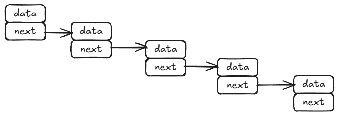
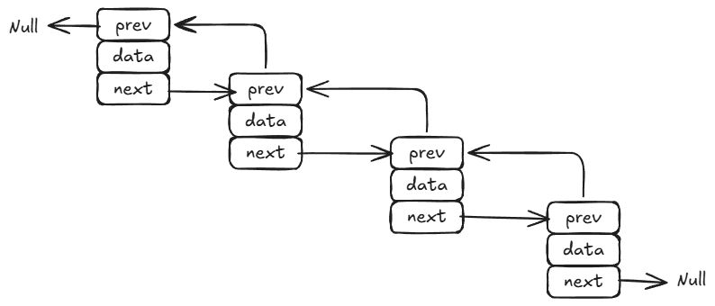
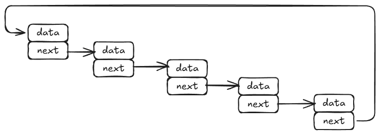

## Linked Lists
Linked lists is a list of nodes which are tied together, the current element has the position of previous or next element or both (prev/next) element. The position here refers to memory location where the next value in memory saved. Here each element is represented as Node.

Ex- [2,3,5] (list)
2->3->5 (linked list (pointer to next element))

There are 3 types of linked list:

* Singly Linked List - It contains the position of next node,. It consumes very less space in comparison of other linked list types.
Ex-
    
* Doubly Linked List - It contains the in memory location of previous and next node. It takes more memory in comparison to singly linked list
Ex-
    

* Circular Linked List - Its same as singly or doubly linked list with head and tail connected, like a circle.
Ex-
    Sinlge Circular Linked List
    
    
    
    Double Circular Linked List

    

#### Implementing a Singly Linked List
```python
class ListNode:
    def __init__(self, val=0, next=None):
        self.val = val
        self.next = next

nodeA1=ListNode(2) 
nodeA2=ListNode(4)
nodeA3=ListNode(3)
nodeA1.next=nodeA2
nodeA2.next=nodeA3

headA1=nodeA1

nodeB1=ListNode(5)
nodeB2=ListNode(6)
nodeB3=ListNode(4)
nodeB1.next=nodeB2
nodeB2.next=nodeB3

headB1=nodeB1

while headA1:
    print(headA1.val, end=" -> ")
    headA1=headA1.next
print("None")
```
